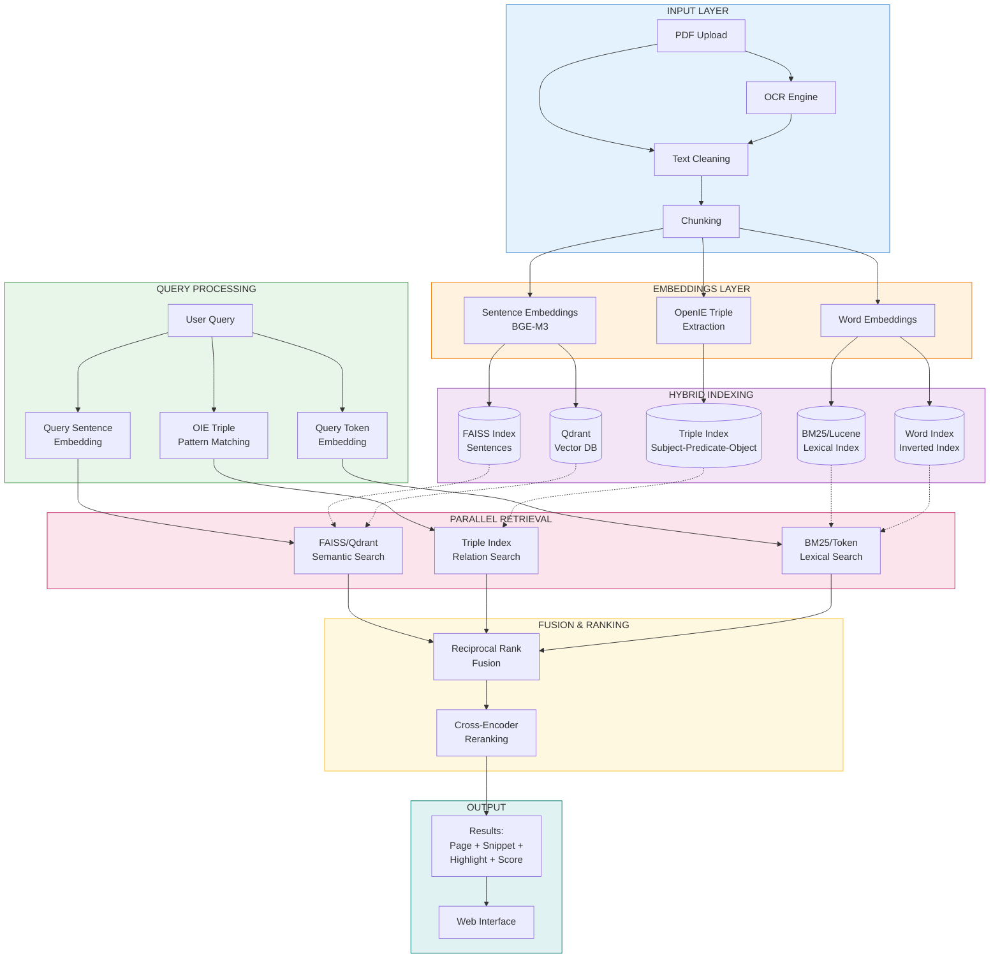
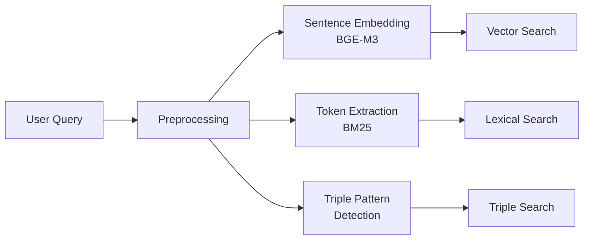
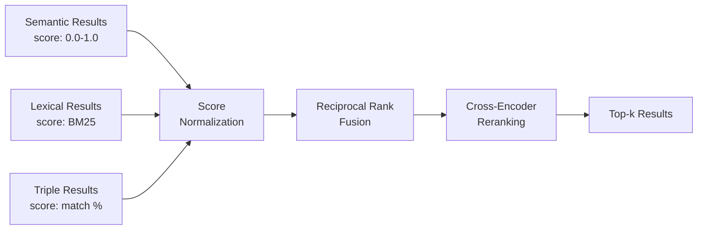
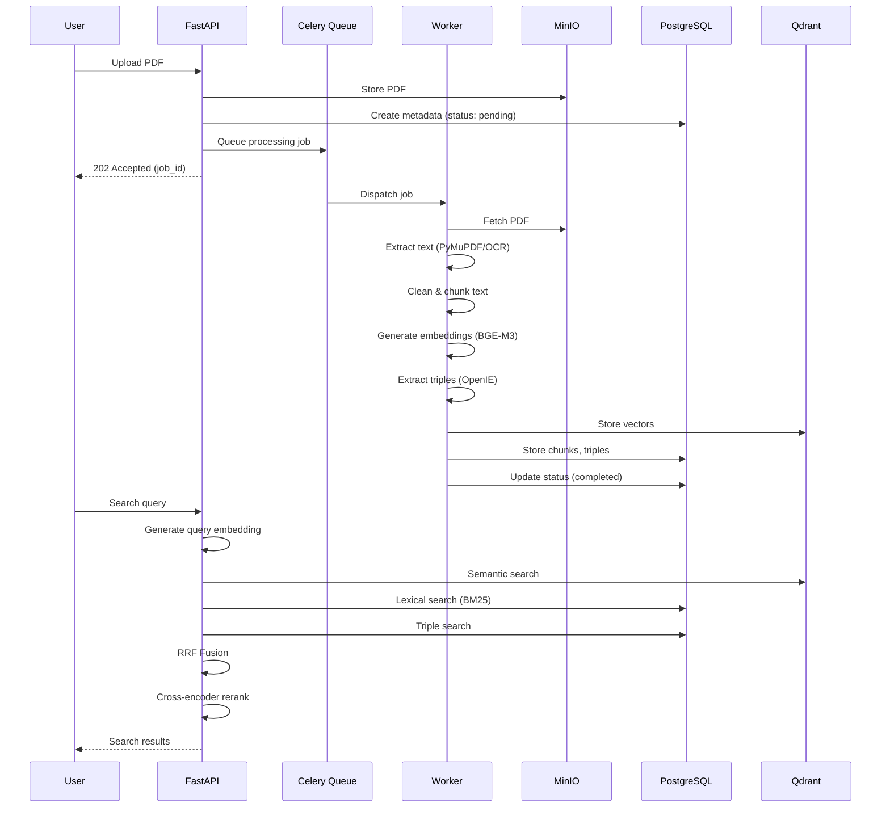

# PDF Search Engine Pipeline

## Architecture Overview



---

## Detailed Pipeline Stages

### 1. Input Layer

| Component | Technology | Purpose |
|-----------|------------|---------|
| **PDF Parsing** | `PyMuPDF (fitz)` | Fast, accurate text extraction with layout preservation |
| **OCR Engine** | `Tesseract` + `pdf2image` | Handle scanned PDFs and images within PDFs |
| **Text Cleaning** | `ftfy` + `regex` | Fix encoding issues, normalize whitespace, remove artifacts |
| **Chunking** | `LangChain TextSplitter` | Split documents into semantic chunks (512-1024 tokens) |

**Why these choices:**
- **PyMuPDF**: 10x faster than PyPDF2, better text extraction quality, handles complex layouts
- **Tesseract**: Industry standard OCR, good accuracy for printed text, free and open-source
- **Chunking Strategy**: Sentence-aware splitting preserves context; overlap (128 tokens) prevents boundary information loss

---

### 2. Embeddings Layer

| Component | Technology | Model | Purpose |
|-----------|------------|-------|---------|
| **Sentence Embeddings** | `sentence-transformers` | `BAAI/bge-m3` | Dense vector representations for semantic search |
| **Word Embeddings** | `FastText` or `BM25 Tokenizer` | - | Sparse representations for lexical matching |
| **OpenIE Triples** | `Stanford OpenIE` or `OpenIE6` | - | Extract (subject, predicate, object) relations |

**Why BGE-M3:**
- Multi-lingual support (100+ languages)
- Multi-granularity (dense + sparse + ColBERT in one model)
- State-of-the-art retrieval performance
- 8192 token context length
- Optimized for retrieval tasks

**Why OpenIE:**
- Captures relational knowledge ("Einstein developed relativity")
- Enables structured queries ("Who developed X?", "What did Y do?")
- Complements semantic search with factual retrieval

---

### 3. Hybrid Indexing

| Index Type | Technology | Data Stored | Use Case |
|------------|------------|-------------|----------|
| **Vector Index** | `Qdrant` | Dense embeddings (768-1024d) | Semantic similarity search |
| **FAISS Index** | `faiss-cpu/gpu` | Dense embeddings (optional) | Fast in-memory search, filtering |
| **Lexical Index** | `Elasticsearch` or `Tantivy` | BM25 inverted index | Exact keyword matching |
| **Triple Index** | `PostgreSQL` + `pg_trgm` | (subject, predicate, object, chunk_id) | Relation-based queries |

**Why Qdrant over Pinecone/Weaviate:**
- Self-hosted (data stays on-premise) ✓
- Built-in filtering and payload storage
- Supports hybrid search natively
- Lower latency for production workloads
- Free and open-source

**Why Hybrid Indexing:**
- Semantic search alone misses exact matches ("Error code E-5021")
- Lexical search alone misses paraphrases ("car" vs "automobile")
- Hybrid combines best of both worlds

---

### 4. Query Processing



| Step | Technology | Description |
|------|------------|-------------|
| **Query Preprocessing** | Custom | Spell correction, query expansion, stopword handling |
| **Query Embedding** | `BGE-M3` | Same model as indexing for consistency |
| **Query Tokenization** | `BM25Encoder` | Extract keywords for lexical search |
| **Triple Pattern Detection** | `SpaCy` + rules | Identify relation patterns in queries |

---

### 5. Parallel Retrieval

| Search Type | Method | Returns |
|-------------|--------|---------|
| **Semantic Search** | Qdrant ANN search (HNSW) | Top-k chunks by cosine similarity |
| **Lexical Search** | BM25 scoring | Top-k chunks by term frequency |
| **Triple Search** | SQL pattern matching | Chunks containing matching relations |

**Retrieval Parameters:**
- `top_k = 100` per search type (before fusion)
- `ef_search = 128` for HNSW (accuracy vs speed tradeoff)
- Parallel execution using `asyncio.gather()`

---

### 6. Fusion & Ranking



| Stage | Technology | Formula/Method |
|-------|------------|----------------|
| **Score Normalization** | Min-Max scaling | `(score - min) / (max - min)` |
| **Reciprocal Rank Fusion** | Custom implementation | `RRF(d) = Σ 1/(k + rank(d))` where k=60 |
| **Cross-Encoder Reranking** | `cross-encoder/ms-marco-MiniLM-L-12-v2` | Pairwise relevance scoring |

**Why RRF:**
- Robust to different score scales
- No hyperparameter tuning needed
- Proven effectiveness in hybrid search
- Simple and fast

**Why Cross-Encoder Reranking:**
- More accurate than bi-encoder similarity
- Considers query-document interaction
- Only applied to top-50 candidates (manageable latency)

---

### 7. Output Layer

| Component | Technology | Purpose |
|-----------|------------|---------|
| **Result Formatting** | Custom | Structure results with metadata |
| **Snippet Extraction** | `regex` + sliding window | Extract relevant text around matches |
| **Highlighting** | Frontend `mark.js` | Highlight matched terms in UI |
| **PDF Viewer** | `react-pdf` / `pdf.js` | Display PDF with highlighted regions |

**Result Schema:**
```json
{
  "results": [
    {
      "document_id": "uuid",
      "document_name": "research_paper.pdf",
      "page_number": 5,
      "chunk_text": "...",
      "snippet": "...relevant excerpt with <mark>highlights</mark>...",
      "score": 0.89,
      "score_breakdown": {
        "semantic": 0.85,
        "lexical": 0.72,
        "triple": 0.95
      },
      "matched_triples": [
        {"subject": "Einstein", "predicate": "developed", "object": "relativity"}
      ],
      "bounding_box": {"x": 100, "y": 200, "width": 400, "height": 50}
    }
  ]
}
```

---

## Technology Stack Summary

### Backend
| Layer | Technology | Reason |
|-------|------------|--------|
| API Framework | **FastAPI** | Async support, auto-docs, type hints |
| Task Queue | **Celery + Redis** | Background PDF processing, scalable workers |
| Vector DB | **Qdrant** | Self-hosted, hybrid search, filtering |
| Relational DB | **PostgreSQL** | Metadata, users, triples, ACID compliance |
| Object Storage | **MinIO** | S3-compatible, self-hosted PDF storage |
| Embedding Model | **BGE-M3** | SOTA retrieval, multi-lingual |
| Reranker | **cross-encoder/ms-marco** | Accuracy boost for top results |
| PDF Parsing | **PyMuPDF** | Speed and accuracy |
| OCR | **Tesseract** | Open-source, good accuracy |
| OpenIE | **OpenIE6** or **Stanford OpenIE** | Relation extraction |

### Frontend
| Layer | Technology | Reason |
|-------|------------|--------|
| Framework | **React + TypeScript** | Type safety, component reuse |
| PDF Viewer | **react-pdf** | Native PDF.js integration |
| State | **React Query** | Server state management, caching |
| Styling | **CSS Modules** | Scoped styles, no runtime overhead |

### Infrastructure
| Layer | Technology | Reason |
|-------|------------|--------|
| Containerization | **Docker Compose** | Easy local development |
| Reverse Proxy | **Nginx** (production) | Load balancing, SSL termination |
| Monitoring | **Prometheus + Grafana** | Metrics and alerting |

---

## Processing Pipeline Flow



---

## Performance Targets

| Metric | Target | Method |
|--------|--------|--------|
| PDF Processing | < 30s per 100 pages | Parallel chunking, batch embedding |
| Search Latency (p95) | < 500ms | HNSW index, result caching |
| Throughput | 100 queries/sec | Async API, connection pooling |
| Index Size | ~1KB per page | Quantized embeddings (int8) |

---

## Future Enhancements

1. **ColBERT Integration**: Late interaction for better accuracy
2. **Query Understanding**: Intent classification, entity recognition
3. **Feedback Loop**: Learn from user clicks to improve ranking
4. **Multi-modal Search**: Search within images/diagrams in PDFs
5. **Clustering**: Group similar documents, topic modeling
